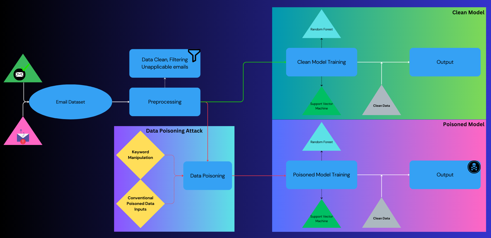

# CYSE635-Group7-DataBusters
Authors:
- Macky Castro - mcast022@odu.edu
- Kurt Karpin - kkarp003@odu.edu

## Introduction
From an attacker’s point of view, this Data Poisoning experiment on phishing emails is designed to obstruct the email system on identifying whether or not emails are considered as safe or phishing. This would provide an AI Developer’s point of view of how secured their AI models should be from any sort of malicious attack like phishing, one of the most popular and applicable types of attack. This experiment involves attacking a dataset of email by manipulating them to be misclassified. This would assume that the attacker would have access to the dataset meaning they would be capable of incorporating any method of data poisoning on the emails that would cause a trigger for misclassification.

This repo consists of the CYSE 635 AI Security and Privacy course project covering the topic of Data Poisoning on datasets like phishing email. This process is split up into three parts:

1.  Email Dataset Setup and Preprocessing
2.  Initial Model Training and Analysis
3.  Data Poisoning Attacks

This would also include a comparitive nalyis of two models being used: Random Forest Classifier and Support Vector Machine.

## Data Poisoning Attacks
Two approaches were conducted on attacking an email dataset.

- Approach 1: Conventional Data Poison method - inserting data poisoned row. This inserts duplicate rows of the dataset and flipping the labels. Up to twice the amount of training data were duplicated with flipped labels. Because the dataset contains more than $18k rows of email content, this process would take a collective of 1 1/2 hours to train both models with as much as twice the original training data being added.
- Approach 2: Keyword changing - this is more of a precise data poisoning attack method, where keywords of the email was taken and manipulated by swapping them over to the oppsite of the gender. For example, the word 'money' is the most common used word amongst phishing emails. We would apply this to critical spots in the safe email dataset for the desired goal of having the model misclassify the emails. 

## Setting up to Run Project
This Jupyter notebook file provided is able to run in Google Collab and also locally as long as Python, pip, and the following libraries are installed:
- Data Preprocessing
  - Numpy
  - Pandas
- Data Visualization
  - Seaborn
  - Matplotlib
- Modeling
  - Scitkit-learn
  - Models: RandomForestClassifier and SVC
- Data Poisoning: Keyword Extraction and Manipulation
  - nltk
  - re
  - Counter
 
 Note when running the notebook, it will prompt to determine if the user is on either Google Collab or running on local machine where it would be assumed that the file would be in the same directory as the notebook file.
